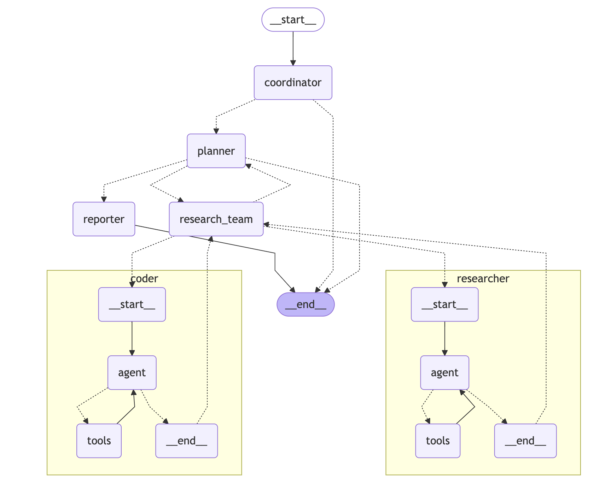

# 🦌 DeerFlow

[](https://www.python.org/downloads/)
[](https://opensource.org/licenses/MIT)
[![DeepWiki](https://img.shields.io/badge/DeepWiki-bytedance%2Fdeer--flow-blue.svg?logo=data:image/png;base64,iVBORw0KGgoAAAANSUhEUgAAACwAAAAyCAYAAAAnWDnqAAAAAXNSR0IArs4c6QAAA05JREFUaEPtmUtyEzEQhtWTQyQLHNak2AB7ZnyXZMEjXMGeK/AIi+QuHrMnbChYY7MIh8g01fJoopFb0uhhEqqcbWTp06/uv1saEDv4O3n3dV60RfP947Mm9/SQc0ICFQgzfc4CYZoTPAswgSJCCUJUnAAoRHOAUOcATwbmVLWdGoH//PB8mnKqScAhsD0kYP3j/Yt5LPQe2KvcXmGvRHcDnpxfL2zOYJ1mFwrryWTz0advv1Ut4CJgf5uhDuDj5eUcAUoahrdY/56ebRWeraTjMt/00Sh3UDtjgHtQNHwcRGOC98BJEAEymycmYcWwOprTgcB6VZ5JK5TAJ+fXGLBm3FDAmn6oPPjR4rKCAoJCal2eAiQp2x0vxTPB3ALO2CRkwmDy5WohzBDwSEFKRwPbknEggCPB/imwrycgxX2NzoMCHhPkDwqYMr9tRcP5qNrMZHkVnOjRMWwLCcr8ohBVb1OMjxLwGCvjTikrsBOiA6fNyCrm8V1rP93iVPpwaE+gO0SsWmPiXB+jikdf6SizrT5qKasx5j8ABbHpFTx+vFXp9EnYQmLx02h1QTTrl6eDqxLnGjporxl3NL3agEvXdT0WmEost648sQOYAeJS9Q7bfUVoMGnjo4AZdUMQku50McDcMWcBPvr0SzbTAFDfvJqwLzgxwATnCgnp4wDl6Aa+Ax283gghmj+vj7feE2KBBRMW3FzOpLOADl0Isb5587h/U4gGvkt5v60Z1VLG8BhYjbzRwyQZemwAd6cCR5/XFWLYZRIMpX39AR0tjaGGiGzLVyhse5C9RKC6ai42ppWPKiBagOvaYk8lO7DajerabOZP46Lby5wKjw1HCRx7p9sVMOWGzb/vA1hwiWc6jm3MvQDTogQkiqIhJV0nBQBTU+3okKCFDy9WwferkHjtxib7t3xIUQtHxnIwtx4mpg26/HfwVNVDb4oI9RHmx5WGelRVlrtiw43zboCLaxv46AZeB3IlTkwouebTr1y2NjSpHz68WNFjHvupy3q8TFn3Hos2IAk4Ju5dCo8B3wP7VPr/FGaKiG+T+v+TQqIrOqMTL1VdWV1DdmcbO8KXBz6esmYWYKPwDL5b5FA1a0hwapHiom0r/cKaoqr+27/XcrS5UwSMbQAAAABJRU5ErkJggg==)](https://deepwiki.com/bytedance/deer-flow)

<!-- DeepWiki badge generated by https://deepwiki.ryoppippi.com/ -->

[English](./README.md) | [简体中文](./README_zh.md) | [日本語](./README_ja.md) | [Deutsch](./README_de.md) | [Español](./README_es.md) | [Русский](./README_ru.md) | [Portuguese](./README_pt.md)

> Originado do Open Source, de volta ao Open Source

**DeerFlow** (**D**eep **E**xploration and **E**fficient **R**esearch **Flow**) é um framework de Pesquisa Profunda orientado-a-comunidade que baseia-se em um íncrivel trabalho da comunidade open source. Nosso objetivo é combinar modelos de linguagem com ferramentas especializadas para tarefas como busca na web, crawling, e execução de código Python, enquanto retribui com a comunidade que o tornou possível.

Atualmente, o DeerFlow entrou oficialmente no Centro de Aplicações FaaS da Volcengine. Os usuários podem experimentá-lo online através do link de experiência para sentir intuitivamente suas funções poderosas e operações convenientes. Ao mesmo tempo, para atender às necessidades de implantação de diferentes usuários, o DeerFlow suporta implantação com um clique baseada na Volcengine. Clique no link de implantação para completar rapidamente o processo de implantação e iniciar uma jornada de pesquisa eficiente.

Por favor, visite [Nosso Site Oficial](https://deerflow.tech/) para maiores detalhes.

## Demo

### Video

<https://github.com/user-attachments/assets/f3786598-1f2a-4d07-919e-8b99dfa1de3e>

Nesse demo, nós demonstramos como usar o DeerFlow para:
In this demo, we showcase how to use DeerFlow to:

- Integração fácil com serviços MCP
- Conduzir o processo de Pesquisa Profunda e produzir um relatório abrangente com imagens
- Criar um áudio podcast baseado no relatório gerado

### Replays

- [Quão alta é a Torre Eiffel comparada ao prédio mais alto?](https://deerflow.tech/chat?replay=eiffel-tower-vs-tallest-building)
- [Quais são os top repositórios tendência no GitHub?](https://deerflow.tech/chat?replay=github-top-trending-repo)
- [Escreva um artigo sobre os pratos tradicionais de Nanjing's](https://deerflow.tech/chat?replay=nanjing-traditional-dishes)
- [Como decorar um apartamento alugado?](https://deerflow.tech/chat?replay=rental-apartment-decoration)
- [Visite nosso site oficial para explorar mais replays.](https://deerflow.tech/#case-studies)

---

## 📑 Tabela de Conteúdos

- [🚀 Início Rápido](#Início-Rápido)
- [🌟 Funcionalidades](#funcionalidades)
- [🏗️ Arquitetura](#arquitetura)
- [🛠️ Desenvolvimento](#desenvolvimento)
- [🐳 Docker](#docker)
- [🗣️ Texto-para-fala Integração](#texto-para-fala-integração)
- [📚 Exemplos](#exemplos)
- [❓ FAQ](#faq)
- [📜 Licença](#licença)
- [💖 Agradecimentos](#agradecimentos)
- [🏆 Contribuidores-Chave](#contribuidores-chave)
- [⭐ Histórico de Estrelas](#Histórico-Estrelas)

## Início-Rápido

DeerFlow é desenvolvido em Python, e vem com uma IU web escrita em Node.js. Para garantir um processo de configuração fácil, nós recomendamos o uso das seguintes ferramentas:

### Ferramentas Recomendadas

- **[`uv`](https://docs.astral.sh/uv/getting-started/installation/):**
  Simplifica o gerenciamento de dependência de ambientes Python. `uv` automaticamente cria um ambiente virtual no diretório raiz e instala todos os pacotes necessários para não haver a necessidade de instalar ambientes Python manualmente

- **[`nvm`](https://github.com/nvm-sh/nvm):**
  Gerencia múltiplas versões do ambiente de execução do Node.js sem esforço.

- **[`pnpm`](https://pnpm.io/installation):**
  Instala e gerencia dependências do projeto Node.js.

### Requisitos de Ambiente

Certifique-se de que seu sistema atenda os seguintes requisitos mínimos:

- **[Python](https://www.python.org/downloads/):** Versão `3.12+`
- **[Node.js](https://nodejs.org/en/download/):** Versão `22+`

### Instalação

```bash
# Clone o repositório
git clone https://github.com/bytedance/deer-flow.git
cd deer-flow

# Instale as dependências, uv irá lidar com o interpretador do python e a criação do venv, e instalar os pacotes necessários
uv sync

# Configure .env com suas chaves de API
# Tavily: https://app.tavily.com/home
# Brave_SEARCH: https://brave.com/search/api/
# volcengine TTS: Adicione sua credencial TTS caso você a possua
cp .env.example .env

# Veja as seções abaixo 'Supported Search Engines' and 'Texto-para-Fala Integração' para todas as opções disponíveis

# Configure o conf.yaml para o seu modelo LLM e chaves API
# Por favor, consulte 'docs/configuration_guide.md' para maiores detalhes
cp conf.yaml.example conf.yaml

# Instale marp para geração de ppt
# https://github.com/marp-team/marp-cli?tab=readme-ov-file#use-package-manager
brew install marp-cli
```

Opcionalmente, instale as dependências IU web via [pnpm](https://pnpm.io/installation):

```bash
cd deer-flow/web
pnpm install
```

### Configurações

Por favor, consulte o [Guia de Configuração](docs/configuration_guide.md) para maiores detalhes.

> [!NOTA]
> Antes de iniciar o projeto, leia o guia detalhadamente, e atualize as configurações para baterem com os seus requisitos e configurações específicas.

### Console IU

A maneira mais rápida de rodar o projeto é usar o console IU.

```bash
# Execute o projeto em um shell tipo-bash
uv run main.py
```

### Web IU

Esse projeto também inclui uma IU Web, trazendo uma experiência mais interativa, dinâmica e engajadora.

> [!NOTA]
> Você precisa instalar as dependências do IU web primeiro.

```bash
# Execute ambos os servidores de backend e frontend em modo desenvolvimento
# No macOS/Linux
./bootstrap.sh -d

# No Windows
bootstrap.bat -d
```

Abra seu navegador e visite [`http://localhost:3000`](http://localhost:3000) para explorar a IU web.

Explore mais detalhes no diretório [`web`](./web/) .

## Mecanismos de Busca Suportados

DeerFlow suporta múltiplos mecanismos de busca que podem ser configurados no seu arquivo `.env` usando a variável `SEARCH_API`:

- **Tavily** (padrão): Uma API de busca especializada para aplicações de IA

  - Requer `TAVILY_API_KEY` no seu arquivo `.env`
  - Inscreva-se em: <https://app.tavily.com/home>

- **DuckDuckGo**: Mecanismo de busca focado em privacidade

  - Não requer chave API

- **Brave Search**: Mecanismo de busca focado em privacidade com funcionalidades avançadas

  - Requer `BRAVE_SEARCH_API_KEY` no seu arquivo `.env`
  - Inscreva-se em: <https://brave.com/search/api/>

- **Arxiv**: Busca de artigos científicos para pesquisa acadêmica
  - Não requer chave API
  - Especializado em artigos científicos e acadêmicos

Para configurar o seu mecanismo preferido, defina a variável `SEARCH_API` no seu arquivo:

```bash
# Escolha uma: tavily, duckduckgo, brave_search, arxiv
SEARCH_API=tavily
```

## Funcionalidades

### Principais Funcionalidades

- 🤖 **Integração LLM**

  - Suporta a integração da maioria dos modelos através de [litellm](https://docs.litellm.ai/docs/providers).
  - Suporte a modelos open source como Qwen
  - Interface API compatível com a OpenAI
  - Sistema LLM multicamadas para diferentes complexidades de tarefa

### Ferramentas e Integrações MCP

- 🔍 **Busca e Recuperação**

  - Busca web com Tavily, Brave Search e mais
  - Crawling com Jina
  - Extração de Conteúdo avançada

- 🔗 **Integração MCP perfeita**

  - Expansão de capacidades de acesso para acesso a domínios privados, grafo de conhecimento, navegação web e mais
  - Integração facilitdade de diversas ferramentas de pesquisa e metodologias

### Colaboração Humana

- 🧠 **Humano-no-processo**

  - Suporta modificação interativa de planos de pesquisa usando linguagem natural
  - Suporta auto-aceite de planos de pesquisa

- 📝 **Relatório Pós-Edição**
  - Suporta edição de edição de blocos estilo Notion
  - Permite refinamentos de IA, incluindo polimento de IA assistida, encurtamento de frase, e expansão
  - Distribuído por [tiptap](https://tiptap.dev/)

### Criação de Conteúdo

- 🎙️ **Geração de Podcast e apresentação**

  - Script de geração de podcast e síntese de áudio movido por IA
  - Criação automatizada de apresentações PowerPoint simples
  - Templates customizáveis para conteúdo personalizado

## Arquitetura

DeerFlow implementa uma arquitetura de sistema multi-agente modular designada para pesquisa e análise de código automatizada. O sistema é construído em LangGraph, possibilitando um fluxo de trabalho flexível baseado-em-estado onde os componentes se comunicam através de um sistema de transmissão de mensagens bem-definido.



> Veja ao vivo em [deerflow.tech](https://deerflow.tech/#multi-agent-architecture)

O sistema emprega um fluxo de trabalho simplificado com os seguintes componentes:

1. **Coordenador**: O ponto de entrada que gerencia o ciclo de vida do fluxo de trabalho

   - Inicia o processo de pesquisa baseado na entrada do usuário
   - Delega tarefas so planejador quando apropriado
   - Atua como a interface primária entre o usuário e o sistema

2. **Planejador**: Componente estratégico para a decomposição e planejamento

   - Analisa objetivos de pesquisa e cria planos de execução estruturados
   - Determina se há contexto suficiente disponível ou se mais pesquisa é necessária
   - Gerencia o fluxo de pesquisa e decide quando gerar o relatório final

3. **Time de Pesquisa**: Uma coleção de agentes especializados que executam o plano:

   - **Pesquisador**: Conduz buscas web e coleta informações utilizando ferramentas como mecanismos de busca web, crawling e mesmo serviços MCP.
   - **Programador**: Lida com a análise de código, execução e tarefas técnicas como usar a ferramenta Python REPL.
     Cada agente tem acesso à ferramentas específicas otimizadas para seu papel e opera dentro do fluxo de trabalho LangGraph.

4. **Repórter**: Estágio final do processador de estágio para saídas de pesquisa
   - Resultados agregados do time de pesquisa
   - Processa e estrutura as informações coletadas
   - Gera relatórios abrangentes de pesquisas

## Texto-para-Fala Integração

DeerFlow agora inclui uma funcionalidade Texto-para-Fala (TTS) que permite que você converta relatórios de busca para voz. Essa funcionalidade usa o mecanismo de voz da API TTS para gerar áudio de alta qualidade a partir do texto. Funcionalidades como velocidade, volume e tom também são customizáveis.

### Usando a API TTS

Você pode acessar a funcionalidade TTS através do endpoint `/api/tts`:

```bash
# Exemplo de chamada da API usando curl
curl --location 'http://localhost:8000/api/tts' \
--header 'Content-Type: application/json' \
--data '{
    "text": "This is a test of the text-to-speech functionality.",
    "speed_ratio": 1.0,
    "volume_ratio": 1.0,
    "pitch_ratio": 1.0
}' \
--output speech.mp3
```

## Desenvolvimento

### Testando

Rode o conjunto de testes:

```bash
# Roda todos os testes
make test

# Roda um arquivo de teste específico
pytest tests/integration/test_workflow.py

# Roda com coverage
make coverage
```

### Qualidade de Código

```bash
# Roda o linting
make lint

# Formata de código
make format
```

### Debugando com o LangGraph Studio

DeerFlow usa LangGraph para sua arquitetura de fluxo de trabalho. Nós podemos usar o LangGraph Studio para debugar e visualizar o fluxo de trabalho em tempo real.

#### Rodando o LangGraph Studio Localmente

DeerFlow inclui um arquivo de configuração `langgraph.json` que define a estrutura do grafo e dependências para o LangGraph Studio. Esse arquivo aponta para o grafo do fluxo de trabalho definido no projeto e automaticamente carrega as variáveis de ambiente do arquivo `.env`.

##### Mac

```bash
# Instala o gerenciador de pacote uv caso você não o possua
curl -LsSf https://astral.sh/uv/install.sh | sh

# Instala as dependências e inicia o servidor LangGraph
uvx --refresh --from "langgraph-cli[inmem]" --with-editable . --python 3.12 langgraph dev --allow-blocking
```

##### Windows / Linux

```bash
# Instala as dependências
pip install -e .
pip install -U "langgraph-cli[inmem]"

# Inicia o servidor LangGraph
langgraph dev
```

Após iniciar o servidor LangGraph, você verá diversas URLs no seu terminal:

- API: <http://127.0.0.1:2024>
- Studio UI: <https://smith.langchain.com/studio/?baseUrl=http://127.0.0.1:2024>
- API Docs: <http://127.0.0.1:2024/docs>

Abra o link do Studio UI no seu navegador para acessar a interface de depuração.

#### Usando o LangGraph Studio

No Studio UI, você pode:

1. Visualizar o grafo do fluxo de trabalho e como seus componentes se conectam
2. Rastrear a execução em tempo-real e ver como os dados fluem através do sistema
3. Inspecionar o estado de cada passo do fluxo de trabalho
4. Depurar problemas ao examinar entradas e saídas de cada componente
5. Coletar feedback durante a fase de planejamento para refinar os planos de pesquisa

Quando você envia um tópico de pesquisa ao Studio UI, você será capaz de ver toda a execução do fluxo de trabalho, incluindo:

- A fase de planejamento onde o plano de pesquisa foi criado
- O processo de feedback onde você pode modificar o plano
- As fases de pesquisa e escrita de cada seção
- A geração do relatório final

## Docker

Você também pode executar esse projeto via Docker.

Primeiro, voce deve ler a [configuração](#configuration) below. Make sure `.env`, `.conf.yaml` files are ready.

Segundo, para fazer o build de sua imagem docker em seu próprio servidor:

```bash
docker build -t deer-flow-api .
```

E por fim, inicie um container docker rodando o servidor web:

```bash
# substitua deer-flow-api-app com seu nome de container preferido
# Inicie o servidor e faça o bind com localhost:8000
docker run -d -t -p 127.0.0.1:8000:8000 --env-file .env --name deer-flow-api-app deer-flow-api

# pare o servidor
docker stop deer-flow-api-app
```

### Docker Compose (inclui ambos backend e frontend)

DeerFlow fornece uma estrutura docker-compose para facilmente executar ambos o backend e frontend juntos:

```bash
# building docker image
docker compose build

# start the server
docker compose up
```

> [!WARNING]
> Se você quiser implantar o DeerFlow em ambientes de produção, adicione autenticação ao site e avalie sua verificação de segurança do MCPServer e Python Repl.

## Exemplos

Os seguintes exemplos demonstram as capacidades do DeerFlow:

### Relatórios de Pesquisa

1. **Relatório OpenAI Sora** - Análise da ferramenta Sora da OpenAI

   - Discute funcionalidades, acesso, engenharia de prompt, limitações e considerações éticas

   - [Veja o relatório completo](examples/openai_sora_report.md)

2. **Relatório Protocolo Agent-to-Agent do Google** - Visão geral do protocolo Agent-to-Agent (A2A) do Google

   - Discute o seu papel na comunicação de Agente de IA e seu relacionamento com o Protocolo de Contexto de Modelo ( MCP ) da Anthropic
   - [Veja o relatório completo](examples/what_is_agent_to_agent_protocol.md)

3. **O que é MCP?** - Uma análise abrangente to termo "MCP" através de múltiplos contextos

   - Explora o Protocolo de Contexto de Modelo em IA, Fosfato Monocálcio em Química, e placa de microcanal em eletrônica
   - [Veja o relatório completo](examples/what_is_mcp.md)

4. **Bitcoin Price Fluctuations** - Análise das recentes movimentações de preço do Bitcoin

   - Examina tendências de mercado, influências regulatórias, e indicadores técnicos
   - Fornece recomendações baseadas nos dados históricos
   - [Veja o relatório completo](examples/bitcoin_price_fluctuation.md)

5. **O que é LLM?** - Uma exploração em profundidade de Large Language Models

   - Discute arquitetura, treinamento, aplicações, e considerações éticas
   - [Veja o relatório completo](examples/what_is_llm.md)

6. **Como usar Claude para Pesquisa Aprofundada?** - Melhores práticas e fluxos de trabalho para usar Claude em pesquisa aprofundada

   - Cobre engenharia de prompt, análise de dados, e integração com outras ferramentas
   - [Veja o relatório completo](examples/how_to_use_claude_deep_research.md)

7. **Adoção de IA na Área da Saúde: Fatores de Influência** - Análise dos fatores que levam à adoção de IA na área da saúde

   - Discute tecnologias de IA, qualidade de dados, considerações éticas, avaliações econômicas, prontidão organizacional, e infraestrutura digital
   - [Veja o relatório completo](examples/AI_adoption_in_healthcare.md)

8. **Impacto da Computação Quântica em Criptografia** - Análise dos impactos da computação quântica em criptografia

   - Discture vulnerabilidades da criptografia clássica, criptografia pós-quântica, e soluções criptográficas de resistência-quântica
   - [Veja o relatório completo](examples/Quantum_Computing_Impact_on_Cryptography.md)

9. **Destaques da Performance do Cristiano Ronaldo** - Análise dos destaques da performance do Cristiano Ronaldo
   - Discute as suas conquistas de carreira, objetivos internacionais, e performance em diversas partidas
   - [Veja o relatório completo](examples/Cristiano_Ronaldo's_Performance_Highlights.md)

Para executar esses exemplos ou criar seus próprios relatórios de pesquisa, você deve utilizar os seguintes comandos:

```bash
# Executa com uma consulta específica
uv run main.py "Quais fatores estão influenciando a adoção de IA na área da saúde?"

# Executa com parâmetros de planejamento customizados
uv run main.py --max_plan_iterations 3 "Como a computação quântica impacta na criptografia?"

# Executa em modo interativo com questões embutidas
uv run main.py --interactive

# Ou executa com um prompt interativo básico
uv run main.py

# Vê todas as opções disponíveis
uv run main.py --help
```

### Modo Interativo

A aplicação agora suporta um modo interativo com questões embutidas tanto em Inglês quanto Chinês:

1. Inicie o modo interativo:

   ```bash
   uv run main.py --interactive
   ```

2. Selecione sua linguagem de preferência (English or 中文)

3. Escolha uma das questões embutidas da lista ou selecione a opção para perguntar sua própria questão

4. O sistema irá processar sua questão e gerar um relatório abrangente de pesquisa

### Humano no processo

DeerFlow inclue um mecanismo de humano no processo que permite a você revisar, editar e aprovar planos de pesquisa antes que estes sejam executados:

1. **Revisão de Plano**: Quando o humano no processo está habilitado, o sistema irá apresentar o plano de pesquisa gerado para sua revisão antes da execução

2. **Fornecimento de Feedback**: Você pode:

   - Aceitar o plano respondendo com `[ACCEPTED]`
   - Edite o plano fornecendo feedback (e.g., `[EDIT PLAN] Adicione mais passos sobre a implementação técnica`)
   - O sistema irá incorporar seu feedback e gerar um plano revisado

3. **Auto-aceite**: Você pode habilitar o auto-aceite ou pular o processo de revisão:

   - Via API: Defina `auto_accepted_plan: true` na sua requisição

4. **Integração de API**: Quanto usar a API, você pode fornecer um feedback através do parâmetro `feedback`:

```json
   {
     "messages": [{ "role": "user", "content": "O que é computação quântica?" }],
     "thread_id": "my_thread_id",
     "auto_accepted_plan": false,
     "feedback": "[EDIT PLAN] Inclua mais sobre algoritmos quânticos"
   }
   ```

### Argumentos via Linha de Comando

A aplicação suporta diversos argumentos via linha de comando para customizar o seu comportamento:

- **consulta**: A consulta de pesquisa a ser processada (podem ser múltiplas palavras)
- **--interativo**: Roda no modo interativo com questões embutidas
- **--max_plan_iterations**: Número máximo de ciclos de planejamento (padrão: 1)
- **--max_step_num**: Número máximo de passos em um plano de pesquisa (padrão: 3)
- **--debug**: Habilita Enable um log de depuração detalhado

## FAQ

Por favor consulte a [FAQ.md](docs/FAQ.md) para maiores detalhes.

## Licença

Esse projeto é open source e disponível sob a [MIT License](./LICENSE).

## Agradecimentos

DeerFlow é construído através do incrível trabalho da comunidade open-source. Nós somos profundamente gratos a todos os projetos e contribuidores cujos esforços tornaram o DeerFlow possível. Realmente, nós estamos apoiados nos ombros de gigantes.

Nós gostaríamos de extender nossos sinceros agradecimentos aos seguintes projetos por suas invaloráveis contribuições:

- **[LangChain](https://github.com/langchain-ai/langchain)**: O framework excepcional deles empodera nossas interações via LLM e correntes, permitindo uma integração perfeita e funcional.
- **[LangGraph](https://github.com/langchain-ai/langgraph)**: A abordagem inovativa para orquestração multi-agente deles tem sido foi fundamental em permitir o acesso dos fluxos de trabalho sofisticados do DeerFlow.

Esses projetos exemplificam o poder transformador da colaboração open-source, e nós temos orgulho de construir baseado em suas fundações.

### Contribuidores-Chave

Um sincero muito obrigado vai para os principais autores do `DeerFlow`, cuja visão, paixão, e dedicação trouxe esse projeto à vida:

- **[Daniel Walnut](https://github.com/hetaoBackend/)**
- **[Henry Li](https://github.com/magiccube/)**

O seu compromisso inabalável e experiência tem sido a força por trás do sucesso do DeerFlow. Nós estamos honrados em tê-los no comando dessa trajetória.

## Histórico-Estrelas

[](https://star-history.com/#bytedance/deer-flow&Date)
